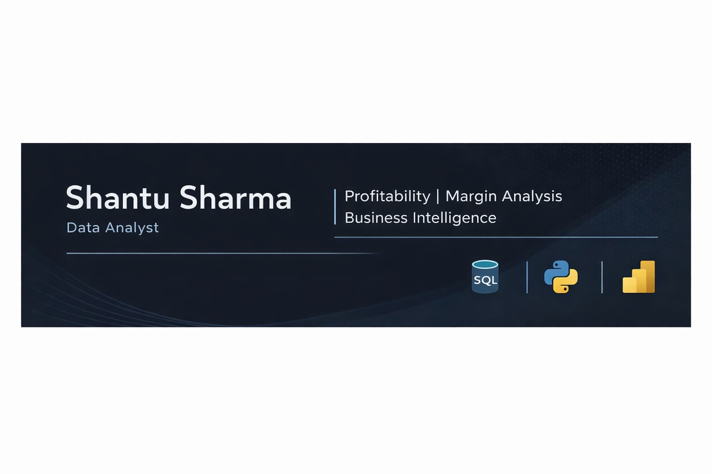

  

<h3 align="center">Data Analyst | Profitability & Margin Analytics</h3>

# Hi, I'm Shantu Sharma👋

Data Analyst | India  
Open to full-time Data Analyst / Business Intelligence roles  

Focused on practical analytics that supports measurable business decisions.

---

## About

Experience centered around understanding how revenue, cost, and margin interact at a product and business level.

Work emphasizes:
- Revenue vs cost evaluation
- Product-level performance analysis
- Margin pressure identification
- Structured data cleaning and validation
- Clear, decision-oriented reporting

Preference for clarity over complexity — analysis should lead to action.

---

## Technical Skills

**Languages & Tools**
- Python (Pandas, NumPy, Matplotlib)
- SQL
- Power BI
- Excel
- Streamlit

**Core Competencies**
- Profit & Margin Analysis
- KPI Development
- Exploratory Data Analysis (EDA)
- Data Cleaning & Validation
- Sales & Product Performance Analysis
- Dashboard Design
- Business Performance Reporting

---

## Projects

Repositories include work focused on:
- Structured profitability analysis
- Margin trend evaluation
- Business performance dashboards
- Reproducible data workflows

Each project documents:
- Problem definition
- Analytical approach
- Tools used
- Key insights
- Visual outputs

---

## Current Focus

Seeking roles involving:
- Business analytics
- Financial performance evaluation
- Decision-support reporting
- Data-driven operational improvement

Open to on-site or remote opportunities.

---

## Contact

Email: theshantusharma@gmail.com  
LinkedIn: https://www.linkedin.com/in/shantusharma27/
